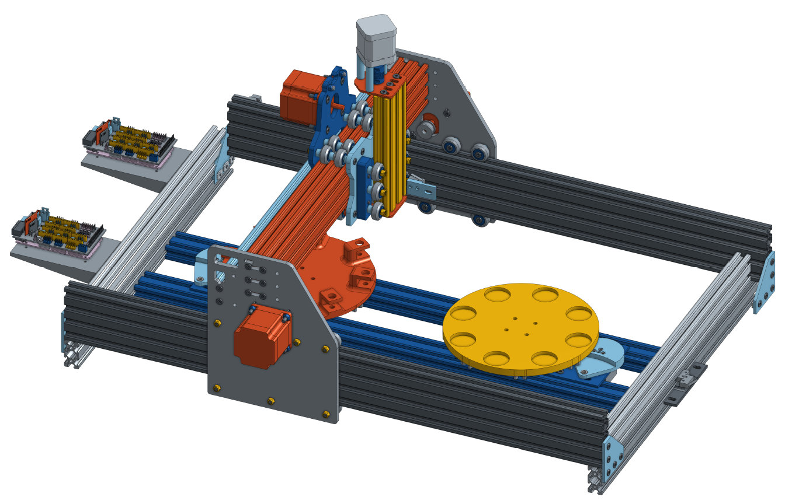

## XYZ CNC Frame

The XYZ is an open source CNC frame built from [aluminium profiles](http://ooznest.co.uk/V-Slot). We use the [OX CNC MECHANICAL KIT (500x750mm) + 4 NEMA 23 Stepper](http://ooznest.co.uk/3D-Printer-CNC-Kits-Bundles/OX-CNC-Machine/OX-CNC-Mechanical-Kit).

To control the XYZ motion we use two [Arduino Mega boards mounted with a Ramps 1.4 shield](http://ooznest.co.uk/3D-Printer-Electronic-Parts/RAMPS-14-Controller-Board-Premium). Each board can control 5 stepper motors, 3 are needed for the XYZ motion. 1 is needed to control our [syringe system](modular_linear_actuator.md), and 3 more to control some of our [working stations](working_stations). The board also controls our [temperature and humidity sensor](https://www.sparkfun.com/products/13683) that records the conditions under each experiment was performed.

The platform is controlled via python on an external computer using our [commanduino tool-kits](https://github.com/croningp/commanduino) allowing to quickly iterate and prototype Arduino based robots:

- the firmware for both Arduino boards is in the [software/arduino](../software/arduino) folder
- the corresponding python robot controller is in the [software/robot](../software/robot) folder

The frame design and 3D files are [available on Onshape]( https://cad.onshape.com/documents/3aeb7616c1e547bfaae38ba3/w/426b95792e7c48a8b6dd7727/e/af7f485263ee4608affce6e3)
