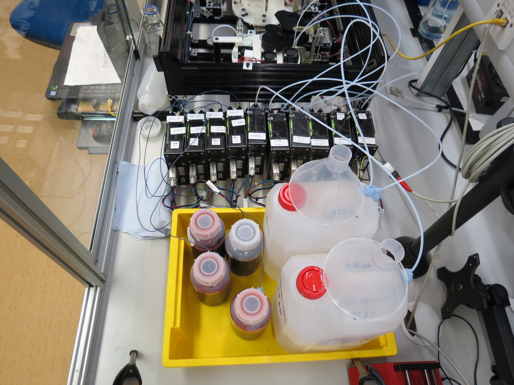
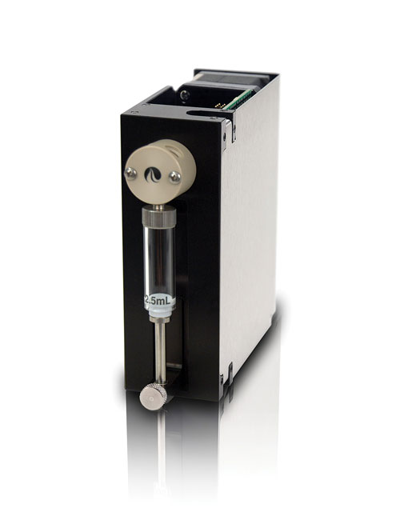
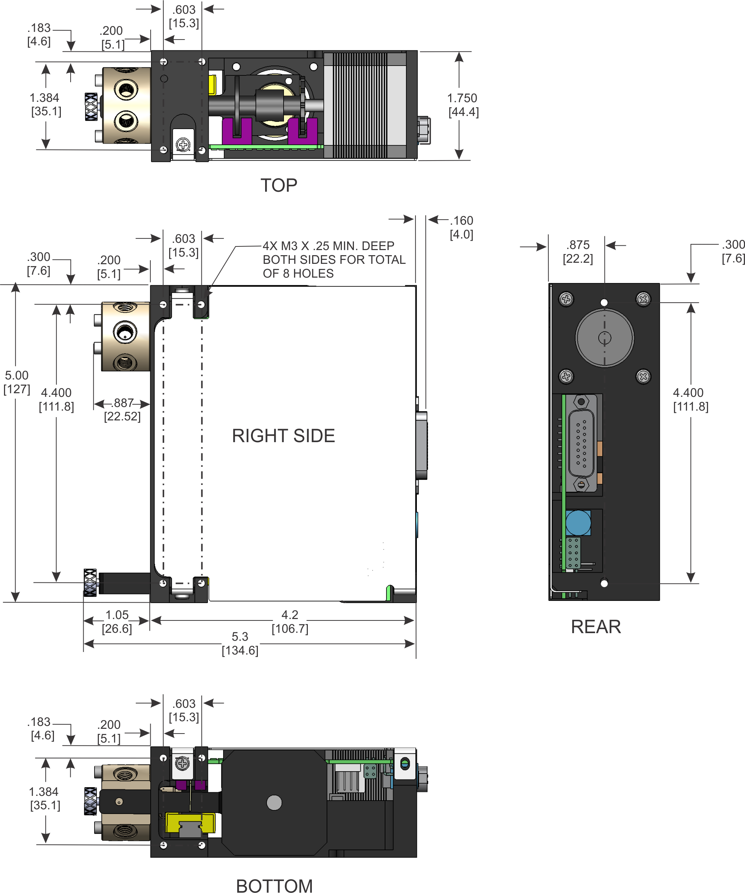

## Pumps

The platform need to handle various liquids such as oils, aqueous phases and acetone. To do so, our group is using [Tricontinent C-Series Syringe Pumps](https://www.tricontinent.com/products/syringe-pumps-and-rotary-valves/c-series-syringe-pumps.html). Dropfactory uses 10 of them.

Here is a top view of the pumps and the reageant containers:

### Pump control

A full documentation of our python library to control the pumps and how to wire them is available at: https://github.com/croningp/pycont

For Dropfactory, the pumps configuration and control is managed in the [software/pump](../software/pump) folder.

### Pumps details

A pump is made of a syringe, whose volume can vary, and a valve that can dispatch the liquid from different directions.

### Tubing

Here is some information about the tubing that connects to the pumps

#### Big:

1/8 inch outer diameter tubing and their fitting

- http://kinesis.co.uk/products/fittings-tubing/tubing/tubing-tubing-ptfe-1-8-3-2mm-od-x-1-5mm-id-10m-008t32-150-10.html
- http://kinesis.co.uk/flangeless-fitting-for-1-8-od-tubing-1-4-28-flat-bottom-delrin-etfe-black-yellow-xp-308.html

#### Small:

1/16 inch outer diameter tubing and their fitting

- http://kinesis.co.uk/products/fittings-tubing/tubing/tubing-tubing-ptfe-1-16-1-6mm-od-x-1-0mm-id-20m-008t16-100-20.html
- http://kinesis.co.uk/flangeless-fitting-for-1-16-od-tubing-1-4-28-flat-bottom-delrin-etfe-black-blue-xp-208.html
