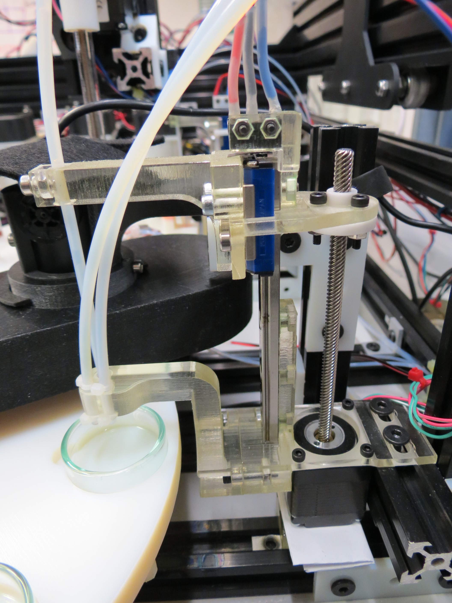
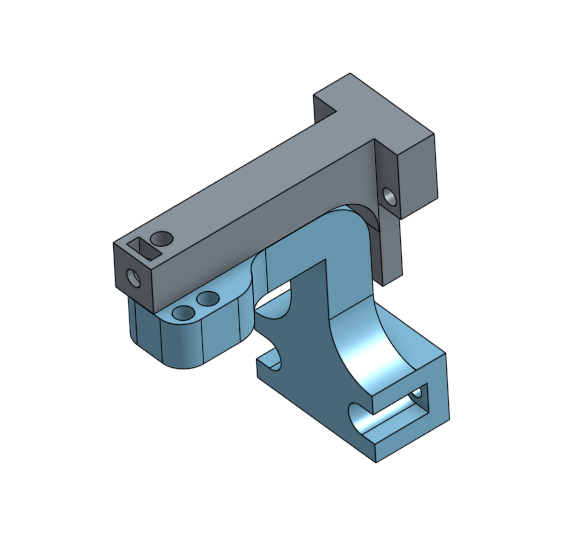

## Dish Cleaning

This station handles three tubes, one to dispense water, one to dispense acetone, and one to empty the dish content to the waste. This later needs to be dipped into the dish, we use our [modular_linear_actuator](../modular_linear_actuator.md) for that.

### Procedure

A petri dish is cleaned using the following protocol:

- empty petri dish of previous experiment's content
- add 4.5mL of acetone into petri dish
- empty petri dish
- add 4.5mL of water into petri dish
- empty petri dish
- add 4.5mL of acetone into petri dish
- empty petri dish
- add 4.5mL of acetone into petri dish
- empty petri dish

### Sources

### 3D designs

- [STL Mount](../../hardware/3d_parts/dish_cleaning/dish_cleaning_mount.stl)
- [STL Guide](../../hardware/3d_parts/dish_cleaning/dish_cleaning_guide.stl)
- [Modular Actuator](https://github.com/croningp/ModularSyringeDriver)
- [Onshape 3D model](https://cad.onshape.com/documents/62d832e8b2dc4f2c03b85d68/w/e45d0051d41b139c7004414d/e/d76ad1c6bf725a9f379d21d0)

### Code

The code managing the dish cleaning working station is here: [software/working_station/clean_petri_dish.py](../../software/working_station/clean_petri_dish.py).
