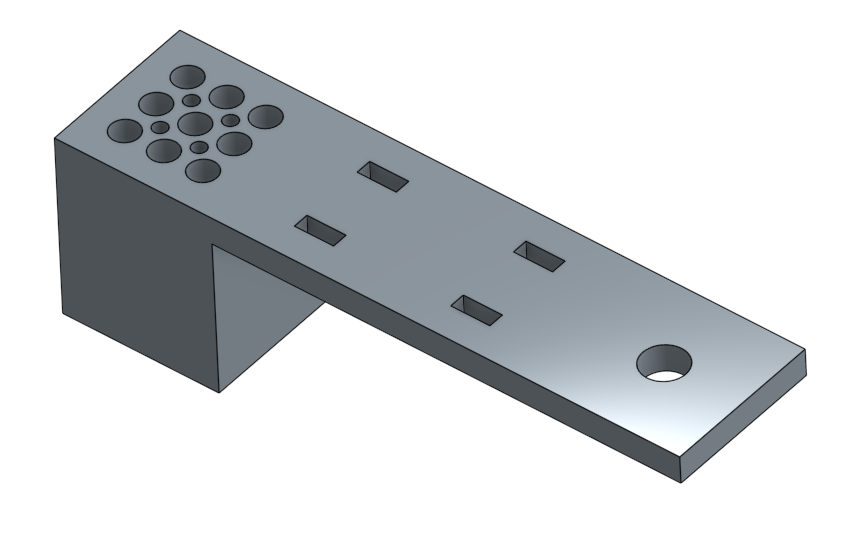
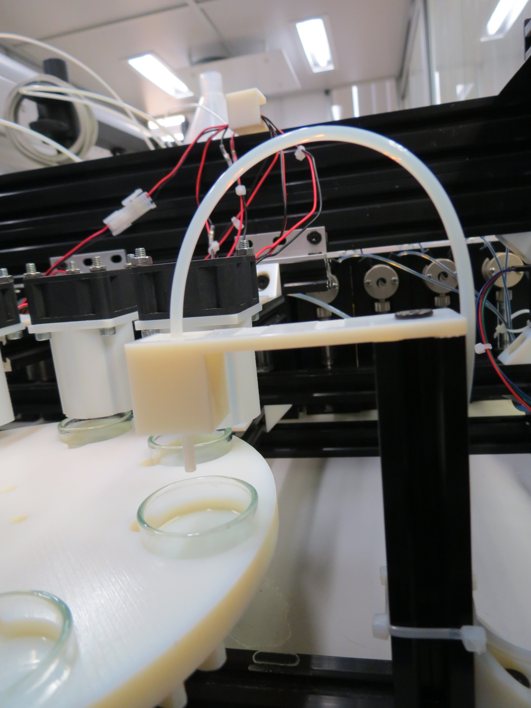

## Dish Filling

This station simple holds some tubes on top of the position 1 of the aqueous wheel.

In most of our experiments we used only one aqueous phase of TTAB at PH 13.

### Sources

### 3D designs

- [STL](../../hardware/3d_parts/dish_filling/dish_filling.stl)
- [Onshape 3D model](https://cad.onshape.com/documents/62d832e8b2dc4f2c03b85d68/w/e45d0051d41b139c7004414d/e/02edab79fbbeda28022ade23)

### Code

The code managing the dish filling working station is here: [software/working_station/fill_petri_dish.py](../../software/working_station/fill_petri_dish.py).

It simply normalizes the quantity given in the experiment description file (see [software](software)) and fill the dish with the given ratios of each aqueous phase given their associated pump and for the defined volume.
