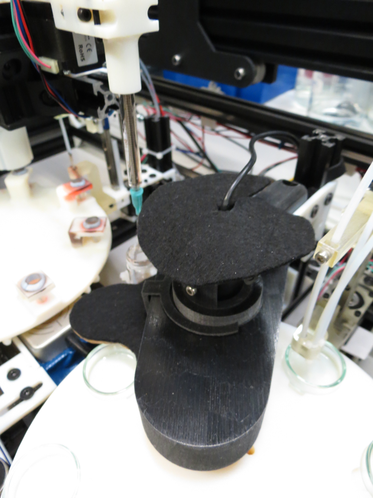
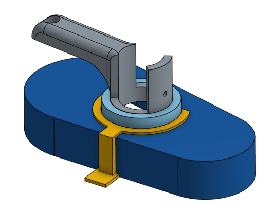

## Dish Recording station

Once the droplet are placed on the aqueous phase, the dish is moved under a camera for the droplet behaviour to be recorded and saved as a video file.

We use a simple webcam for recording but need to ensure the lighting condition are very similar between each experiments. Especially, it is important to remove all light reflection on the water surface that hinger the performance of image analysis of the droplets.

### Sources

#### Materials

- [MICROSOFT  6CH-00002](http://onecall.farnell.com/microsoft/6ch-00002/webcam-lifecam-cinema-business/dp/CS25782)

### 3D designs

- All STL files available in the [hardware/3d_parts/camera_holder](../../hardware/3d_parts/camera_holder) folder
- [Onshape 3D model](https://cad.onshape.com/documents/62d832e8b2dc4f2c03b85d68/w/e45d0051d41b139c7004414d/e/f1aad30ed184d979bb4387d0)

### Code

The code managing the camera working station is here: [software/working_station/record_video.py](../../software/working_station/record_video.py). This simply trigger the recording of a video of given duration into a specified file.

It utilizes tools from our [chemobot_tools](https://github.com/croningp/chemobot_tools) library, and is interfaced and configured in the [software/webcam](../../software/webcam) folder.
