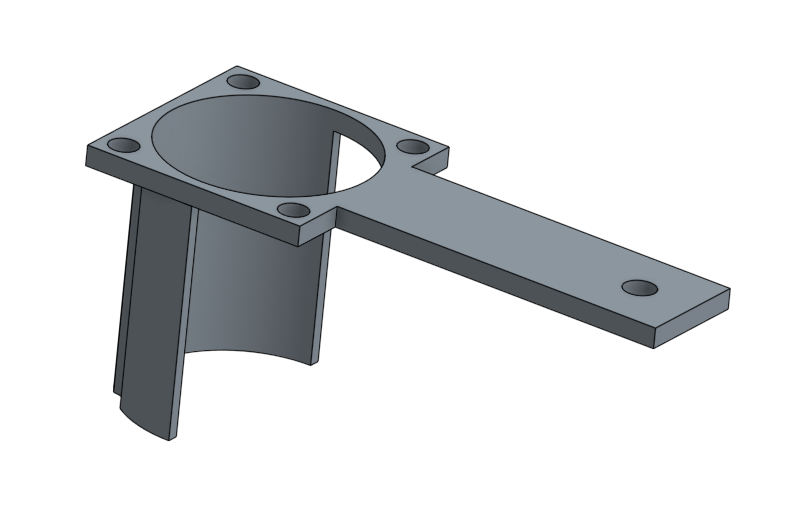
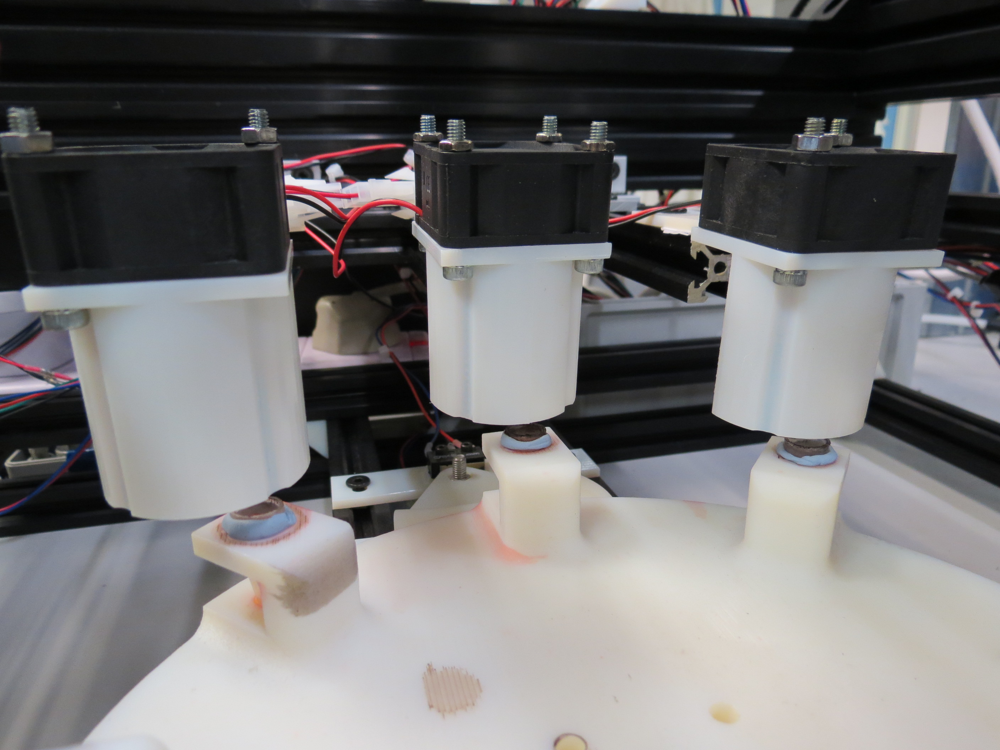
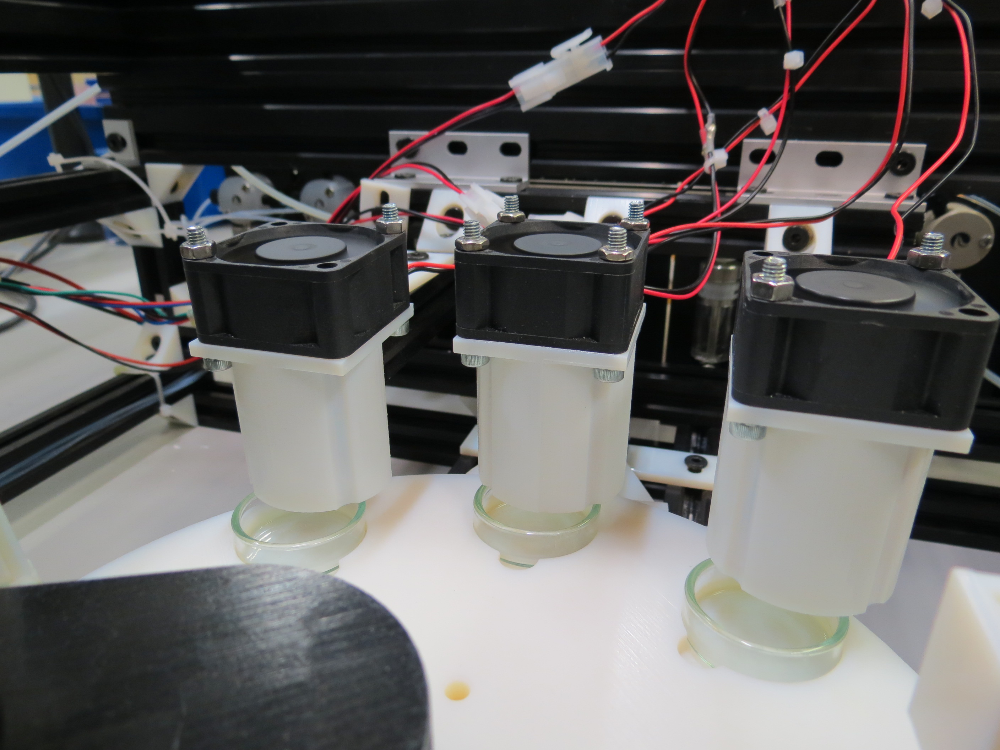

## Drying Station

The drying station is a simple fan blowing air into a container that was previously cleaned with water and acetone. We made sure this additional air flow did not impact our droplet experiments. The drying stations are at the position 6, 7, and 8 of both oil and aqueous wheels.

### Sources

- [STL](../../hardware/3d_parts/various/evaporator.stl)
- [Onshape 3D model](https://cad.onshape.com/documents/62d832e8b2dc4f2c03b85d68/w/e45d0051d41b139c7004414d/e/ae1bb1b32d86c37772960515)
