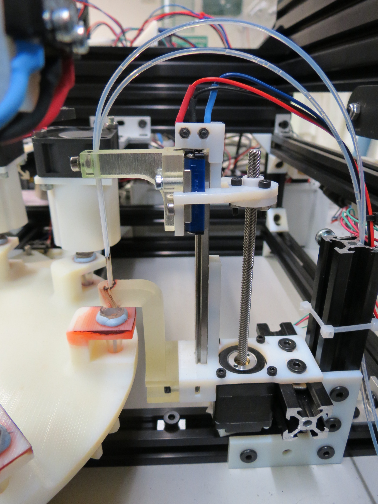
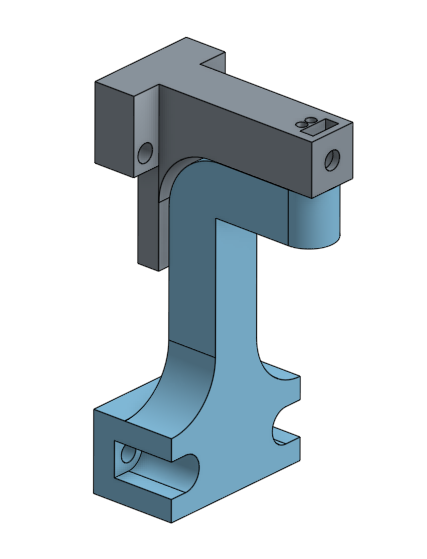

## Oil Cleaning

This station handles two tubes, one to dispense acetone and one to empty the vials' content to the waste. This later needs to be dipped into the dish, we use our [modular_linear_actuator](../modular_linear_actuator.md) for that.

### Procedure

An oil vial is cleaned usiing the following protocol:

- pump vial content to waste, 2mL (largely exceeding vial volume)
- repeat 5 times:
    - add 0.7mL of acetone into vial
    - pump vial content to waste, 2mL (largely exceeding vial volume)

### Sources

### 3D designs

- [STL Mount](../../hardware/3d_parts/oil_cleaning/oil_cleaning_mount.stl)
- [STL Guide](../../hardware/3d_parts/oil_cleaning/oil_cleaning_guide.stl)
- [Modular Actuator](https://github.com/croningp/ModularSyringeDriver)
- [Onshape 3D model](https://cad.onshape.com/documents/62d832e8b2dc4f2c03b85d68/w/e45d0051d41b139c7004414d/e/ba40210f0cf61fe838ccdc8a)

### Code

The code managing the oil cleaning working station is here: [software/working_station/clean_oil_parts.py](../../software/working_station/clean_oil_parts.py). This file also manages the cleaning of the syringe.
