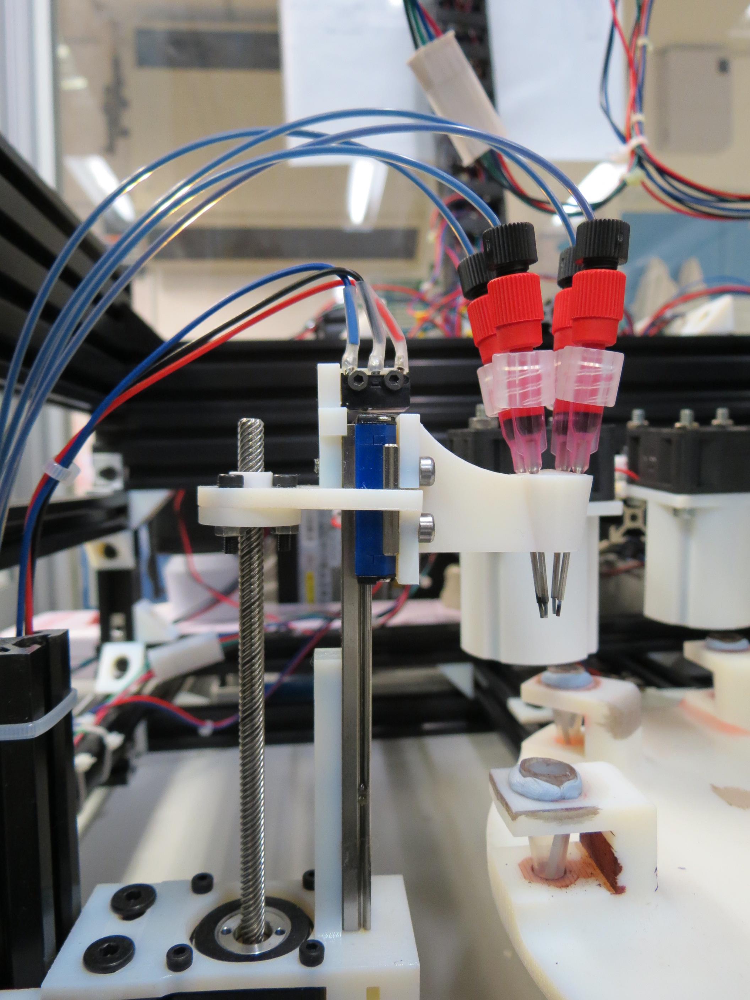
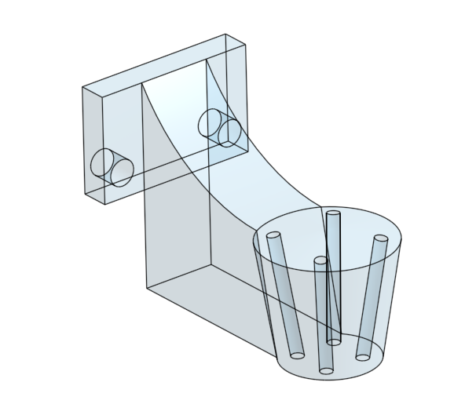

## Oil Filling

This station handles 4 tubes, one for each of the 4 oils we used in most of our experiments. To ensure accurate dispensing, we lower down the dispnesing head into the vial using our [modular_linear_actuator](../modular_linear_actuator.md).

### Procedure

- the head is lowered down so the tips of the dispensing needles comes into the vials
- the desired oils are dispensed with a given ratio to a total volume of 0.5mL
- the head is lowered down so the tips of the dispensing needles comes into contact with the surface of the oil mixture, this is to remove any pending drops remaining on the tips of the droplets
- the head comes back to its home position

### Sources

### 3D designs

- [STL Mount](../../hardware/3d_parts/oil_filling/oil_filler.stl)
- [Modular Actuator](https://github.com/croningp/ModularSyringeDriver)
- [Onshape 3D model](https://cad.onshape.com/documents/62d832e8b2dc4f2c03b85d68/w/e45d0051d41b139c7004414d/e/1583bc5599c1a1019a2f3e93)

### Code

The code managing the oil cleaning working station is here: [software/working_station/fill_oil_tube.py](../../software/working_station/fill_oil_tube.py).
