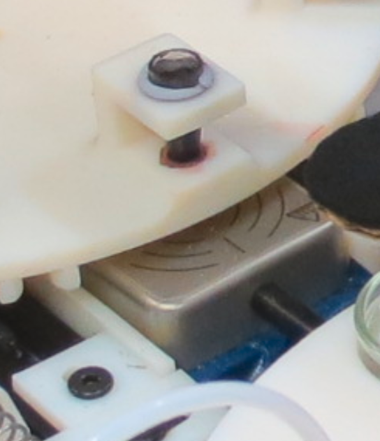

## Oil Stirring Station

In each oil vials, there is a small magnetic stirrer. At the stirring station (position 3 of the oil wheel) a compact magnetic stirrer ensure the oils are fully mixed before being sampled by the syringe. Such small magnetic stirrers tends to over heat, for this reason a fan has been positioned below the stirrer to regulate its temperature.

### Sources

#### Materials

- [STIRRER MICRO 07 + UK TELEMODUL 7W, from H + P LABORTECHNIK. Supplied at VWR, catalog number is 442-3116]( https://uk.vwr.com/store/product/442-3116/stirrer-micro-07-%2B-uk-telemodul-7w-1-1-items)
- [Stir bars - plain economy 4.0x0.8. Magnetic stirring bars, plain, economy. Supplied from VWR, catalog number is 442-0484](https://uk.vwr.com/store/catalog/product.jsp?catalog_number=442-0484)

#### 3D designs

- [STL Stirrer Holder](../../hardware/3d_parts/oil_mixing/stirrer_holder.stl)
- [STL Stirrer Fan Holder](../../hardware/3d_parts/oil_mixing/stirrer_fan_holder.stl)
- [Onshape 3D model](https://cad.onshape.com/documents/62d832e8b2dc4f2c03b85d68/w/e45d0051d41b139c7004414d/e/7f2bc6ac687a7f6977a3b478)
