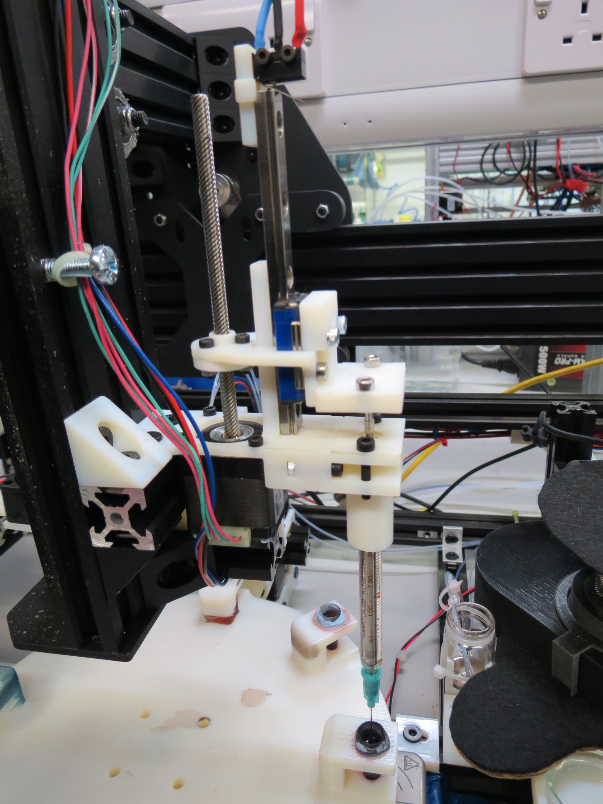

## Syringe

The syringe is used for droplet placements, that is it move to collect the oil mixture, then move to the petri dish and place the droplets and finally cleans it-self before moving the next experiments. The experimental parameters are fully described in the experiment configuration file, see [software](../../software).

### Procedures

#### Syringe Oil Filling

- move syringe on top of oil vial (position 3 of oil wheel)
- move syringe down to dip needle into the oil
- repeat 5x: pump and release 50mL of oil mixture, this is to double ensure oils are mixed in addition of the stirrer
- pump 20uL more oil mixture than droplet making requires (total volume of requested droplets)
- move syringe up

#### Droplet Making

- move syringe on top of the center of the petri dish (position 3 of aqueous wheel)
- for each droplets defined in the config file:
    - move to given relative position, making sure it is not outside the petri dish
    - deliver given droplet volume, the droplet should not be release at this point but stick to the needle
    - move syringe down to contact with the surface
    - move syringe up again above aqueous phase level
- move syringe up high above

#### Syringe Cleaning

- move syringe on top of the dedicated syringe cleaning vial
- empty syringe in the vial
- wash the vial with 1.5 mL acetone
- add 2.5mL acetone into vial
- dip needle into acetone
- repeat 3x: pump and deliver 100uL of acetone through the syringe, ensuring cleaning of remaining in oil mixture
- move syringe up again above vial
- empty vial of its content
- repeat 8x: pump and deliver 100uL of air through the syringe, ensuring drying of remaining acetone
- wash the vial with 1 mL acetone

### Sources

### Materials

- our syringe module is compatible with all [uL Hamilton syringes](https://www.hamiltoncompany.com/products/syringes-and-needles/general-syringes/microliter-syringes/250-microL-Model-725-LT-SYR-NDL-Sold-Separately)
- we use dispensing needle of [this serie](http://uk.farnell.com/weller/kds2312p/dispensing-needle-ga23-id-0-43mm/dp/3975630), see [catalog](http://www.farnell.com/datasheets/514885.pdf).

### 3D designs

- [Modular Actuator](https://github.com/croningp/ModularSyringeDriver)
- [STL Cleaning Vial Holder](hardware/3d_parts/various/vial_holder.stl)
- [Onshape Cleaning Vial Holder](https://cad.onshape.com/documents/62d832e8b2dc4f2c03b85d68/w/e45d0051d41b139c7004414d/e/640ac0deb1f80bf00c4bdb79)

### Code

The code managing the syringe is split into two files:

- [software/working_station/clean_oil_parts.py](../../software/working_station/clean_oil_parts.py) for cleaning the syringe, this is because the pumps for acetone and waste are shared between the [oil vial cleaning station](oil_cleaning.md).
- [software/working_station/clean_oil_parts.py](../../software/working_station/clean_oil_parts.py) that takes care of the sampling of oils and the droplet placement.
